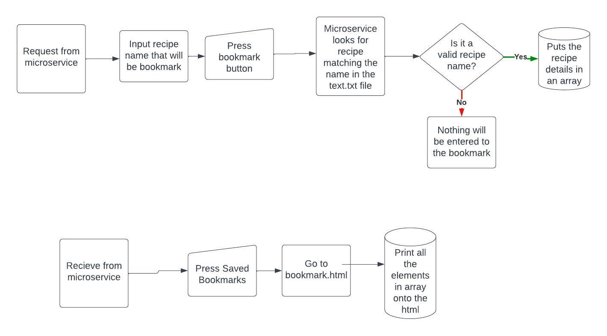

To request the mircorservice to add a recipe into the bookmarks. Enter the name of the recipe in the textbox right next to the Bookmark button. It will saved the recipe onto an array.
To recieve data from the microservice/viewing all bookmarks, press the saved bookmark button that will show all the bookmark you saved to the array.

